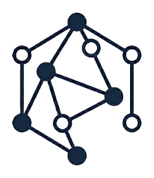

<p align="center">
  <picture>
    <source media="(prefers-color-scheme: dark)" srcset="frontend/src/assets/logo-dark.png">
    <source media="(prefers-color-scheme: light)" srcset="frontend/src/assets/logo-light.png">
    
  </picture>
</p>

# Spatia

**Geometric Lisp and Semantic Graph Protocol**

Spatia is a framework for Human-AI symmetry that treats code as a **Universal Semantic Graph (USG)** rather than a collection of flat files. It introduces a protocol for verifying "Atoms" (semantic units of code) through a rigorous **Witness Protocol**, enabling a transition from simple text editing to high-trust semantic engineering.

## Milestone: Phase 11 - Gemini 2.5 Summoning Integration
**v0.11.0**
- **Projector Core**: Implemented AI bridge using `google-genai` SDK.
- **Summoning Gateway**: POST `/api/summon` endpoint for transforming Lisp Intent (Slang B) into implementation (Slang A).
- **Gemini Integration**: Supports `gemini-2.5-flash`, `gemini-2.5-pro`, and `gemini-3-flash` for variable latency/intelligence loops.
- **Symmetry Translation**: Automated context gathering from Portals and Thread Neighbors.

## Core Philosophy

*   **Atoms over Files:** Code is decomposed into discrete semantic units called Atoms.
*   **Geometry over Flux:** The spatial relationship and "projection" of code matter more than chronological git history.
*   **Epistemic Integrity:** A 4-stage lifecycle for code verification (Claim -> Witness -> Endorsed -> Immutable).

For more theoretical background, see the [Documentation](docs/):
*   [Manifest](docs/MANIFEST.md)
*   [Theory](docs/THEORY.md)
*   [Epistemic Integrity](docs/EPISTEMIC_INTEGRITY.md)

## Requirements

*   [Devbox](https://www.jetpack.io/devbox) (for hermetic environment management)
*   Python 3.10+
*   Node.js 18+

## Getting Started

1.  **Initialize the Environment**
    Start the devbox shell to set up the python virtual environment:
    ```bash
    devbox shell
    ```

2.  **Install Backend Dependencies**
    Inside the devbox shell:
    ```bash
    pip install -r requirements.txt
    ```

3.  **Setup System Config**
    Initialize the Sentinel Database (`.spatia/sentinel.db`) and directory structure:
    ```bash
    make setup
    ```

4.  **Install Frontend Dependencies**
    ```bash
    cd frontend
    npm install
    cd ..
    ```

## Running Spatia

Spatia consists of a FastAPI backend and a React frontend. You can run them using the configured devbox scripts.

### Backend Server
Starts the FastAPI server on `http://localhost:8000`.
```bash
devbox run server
```

### Frontend Client
Starts the React development server.
```bash
devbox run web
```

## Project Structure

*   `backend/`: FastAPI application acting as the nervous system for the semantic graph.
*   `frontend/`: React-based visual interface (Canvas) using React Flow.
*   `.spatia/`: Hidden directory containing the **Sentinel DB** (SQLite) and local Atom storage.
*   `docs/`: Core documentation and theoretical foundations.
*   `tests/`: Pytest suite for backend and protocol verification.

## Development

Run the test suite:
```bash
pytest
```
